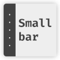

# Smallbar
Simple, fast and small navigation sidebar



## Usage
### Main Structure
1. Load both `smallbar.css` and `smallbar.js` in your html-document
2. Use the following Main Structure:
    ```html
    <aside id="smallbar">
        <nav>
            <ul>
                <!-- Navigation Links -->
            </ul>
        </nav>
        <ul class="bottom-fixed">
            <li>
                <div class="link-content opener">
                    <div class="icon">
                        <!-- Pin Icon -->
                    </div>
                </div>
            </li>
        </ul>
    </aside>
    <main>
        <!-- Your content here -->
    </main>
    ```
3. Replace `<!-- Pin Icon -->` with an icon, e.g. from Font Awesome
4. Put in some links (from above) instead of `<!-- Navigation Links -->`

### Links
There ar two types of links: Normal links and links with a sublist

#### Links
```html
<li>
    <a href="#" class="link-content">
        <div class="icon">
            <!-- Link Icon -->
        </div>
        <div class="text">
            <!-- Link Text -->
        </div>
    </a>
</li>
```

#### Links with Subnavigation
```html
<li>
    <a href="#" class="link-content">
        <div class="icon">
            <!-- Link Icon -->
        </div>
        <div class="text">
            <!-- Link Text -->
        </div>
        <div class="icon last">
            <-- Subnav State Indicator Icon -->
        </div>
    </a>
    <ul class="subnav">
        <!-- Some Links -->
    </ul>
</li>
```

## Compatibility
As smallbar makes heavy use of CSS-Variables, browser support of CSS-Variables is a must. 

 |  |  |  | | 
--- | --- | --- | --- | --- | --- |
18 ✔ | 66+ ✔ | none ❌ | 16+ ✔ | 10+ ✔ | 10+ ✔ |
